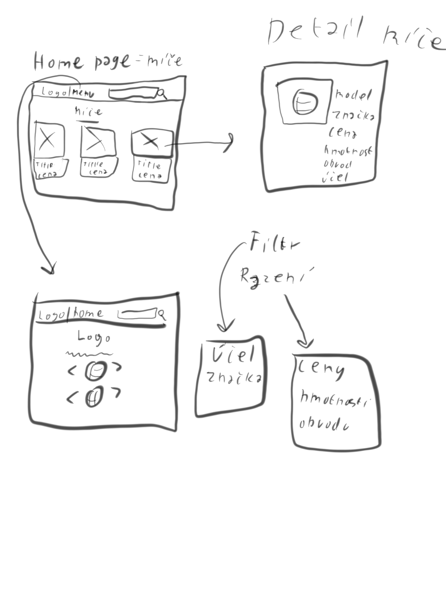

# Databáze a obchod volejbalových míčů
*Autor: Adrian Ibrahim <adrian.ibrahim.s@gyarab.cz>
Ukázkový ročníkový projekt z předmětu webové technologie ve šk. roce 2024/2025.

## Odborný článek
 Databáze a obchod je webová aplikace přístupná na https://example.gyarab.cz.
 V administraci se spravuje databáze míčů, každý z míčů má název, značku, hmotnost, obvod, cena a typ míče (indoor, beach, tréninkový, dětský)
Na homepage je seznam karet volejbalových míčů, kliknutím na kartu se zobrazí atributy míče(značka, hmotnost, obvod, cena...). 
 Homepage má fulltext vyhledávání- po zadání výrazu se vypíší filmy/osobnosti, které mají hledaný výraz v názvu nebo popisu.

Hlavní menu obsahuje odkaz na homepage (seznam míčů) a ukazuje několik běžných míčů.

## Wireframes

## class diagram

